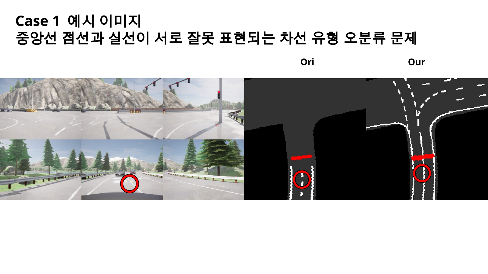

# HBLR

[English](README.md)

평소 자주 사용하는 자율주행 모델들의 BEV 값을 가져와 시각화하고, 카메라 관측과 비교한 프로젝트입니다. 모델별 BEV에서 차선, 주행 가능 영역, 도로 고도가 어떻게 표현되는지 살펴보고, 기존 표현(`Ori`)과 HBLR의 수정 표현(`Our`)을 함께 보여줍니다.

색깔 동그라미는 카메라 관측과 BEV에서 서로 비교할 위치를 표시합니다. `Ori`는 기존 표현, `Our`는 HBLR의 수정 표현입니다.

## 모델별 BEV 시각화

| 모델 | 본문에 포함한 예시 |
| --- | --- |
| LAV | BEV 시각화, 차선 존재 여부, 도로 고도 |
| TransFuser | 차선 존재 여부 비교 |
| Think2Drive | 차선 존재 여부 비교 |
| Roach | 도로 고도와 고가도로 예시 |
| ThinkTwice | Roach와 함께 살펴본 BEV 입력 및 CNN 특징 시각화 |

## 네 가지 비교 사례

| 사례 | 관찰한 문제 | 수정 방향 |
| --- | --- | --- |
| 1. 차선 유형 | 중앙선의 점선과 실선이 잘못 표현됨 | 장면에 보이는 차선 유형 유지 |
| 2. 차선 존재 여부 | 없는 차선이 생성되거나 있는 차선이 누락됨 | 실제 차선의 존재와 연결 구조 반영 |
| 3. 주행 가능 영역 | BEV 영역이 실제 도로 형상과 다름 | 도로 경계와 교차로 형상 정합성 개선 |
| 4. 고도 | 고가도로와 하부 도로가 BEV에서 중첩됨 | 자차가 위치한 도로 높이에 맞는 영역 분리 |

## 사례 1: 차선 유형

**기존·수정 비교 · `Ori` / `Our`.** 점선과 실선이 카메라 관측과 일치하는지 비교합니다. 동그라미는 중앙선 유형이 다르게 표현되는 위치를 표시합니다.

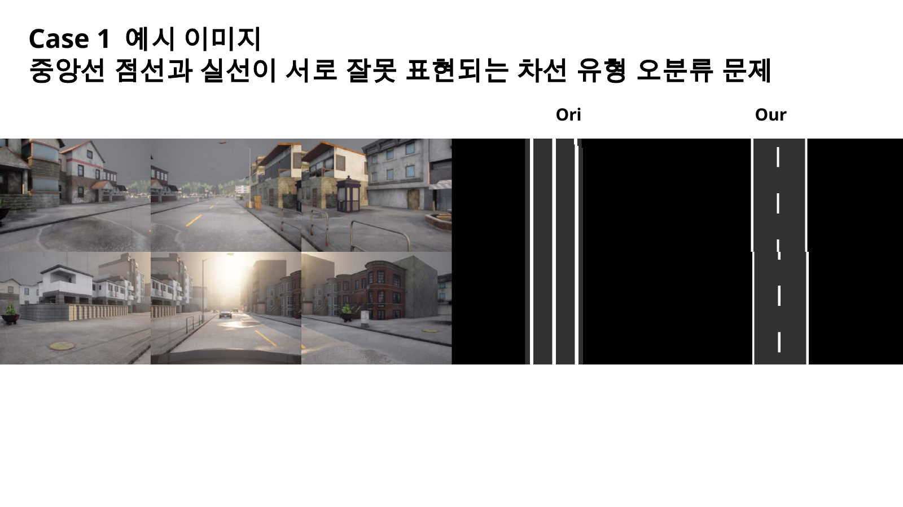

### LAV BEV 시각화

LAV의 BEV 표현을 주행 장면과 함께 놓고 비교합니다.

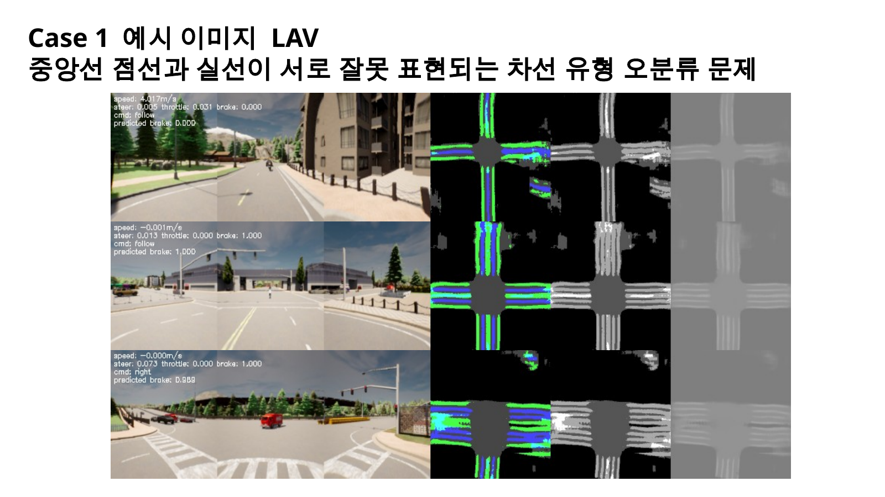

## 사례 2: 차선 존재 여부

실제로 보이는 차선이 BEV에 포함되는지, 차선이 없는 곳에 차선이 생성되는지 비교합니다. 교차로, 회전교차로, 곡선 도로의 예시를 포함합니다.

**`Ori` / `Our` 비교 및 LAV BEV 시각화.**

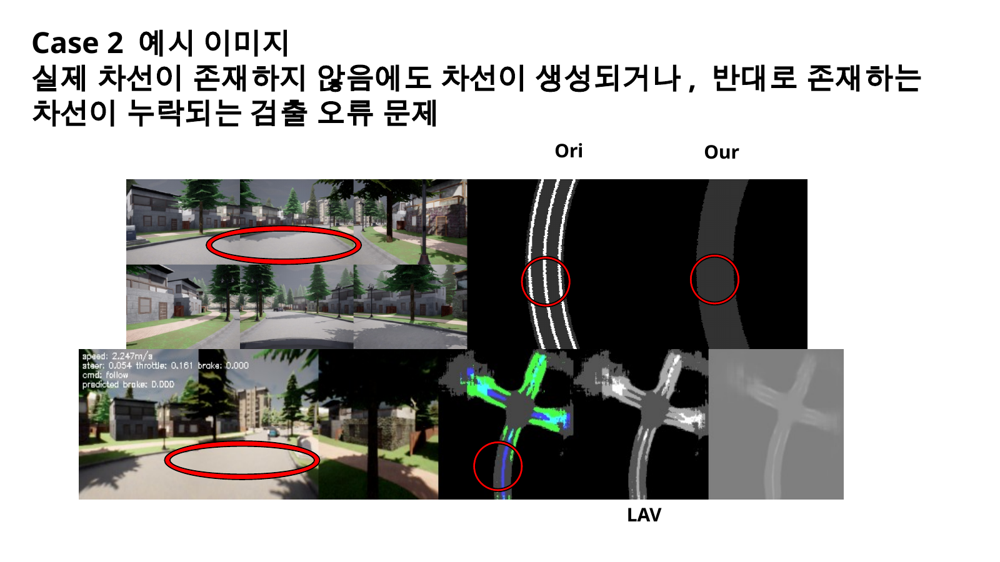

### TransFuser

TransFuser의 BEV 시각화를 기존 표현 및 HBLR의 수정 표현과 함께 보여줍니다.

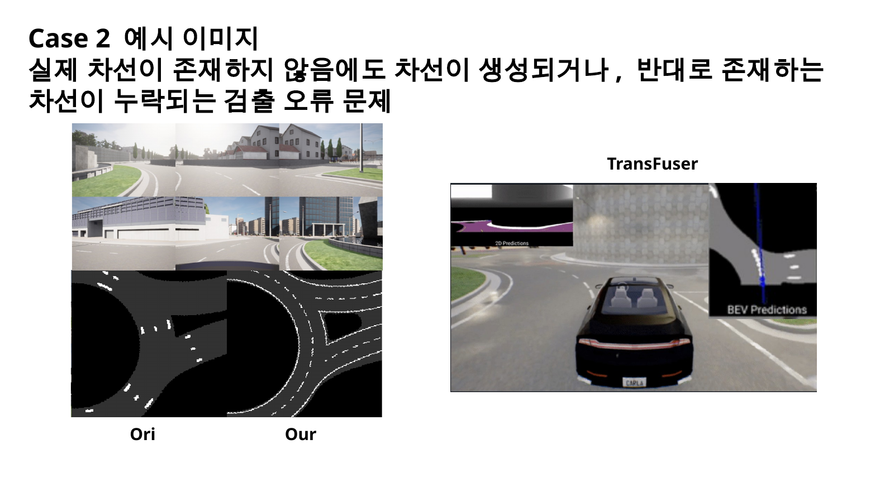

### Think2Drive와 LAV

오른쪽 위는 Think2Drive, 아래쪽은 LAV의 BEV 시각화입니다. 왼쪽 위는 `Ori` / `Our` 비교입니다.

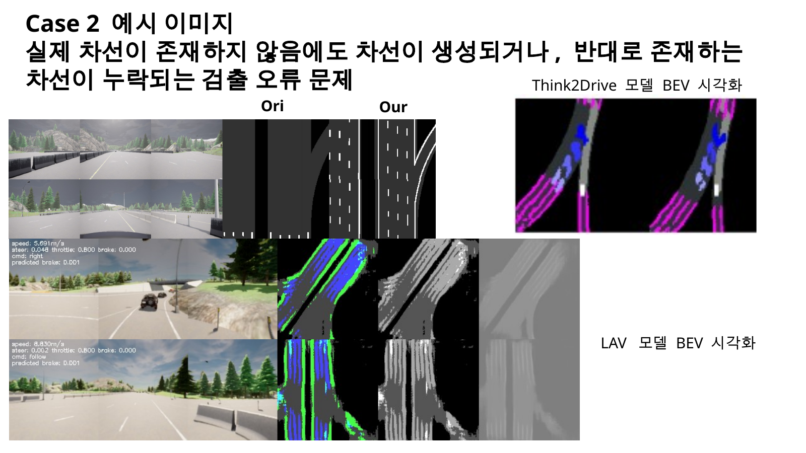

### LAV 및 추가 비교

동그라미는 주행 장면의 위치와 BEV의 해당 영역을 연결해서 보여줍니다.

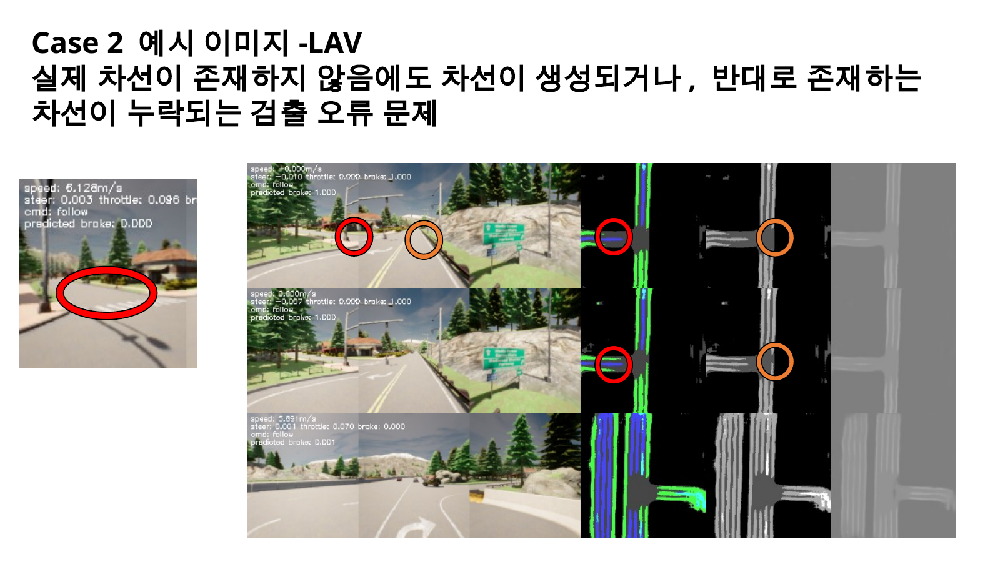

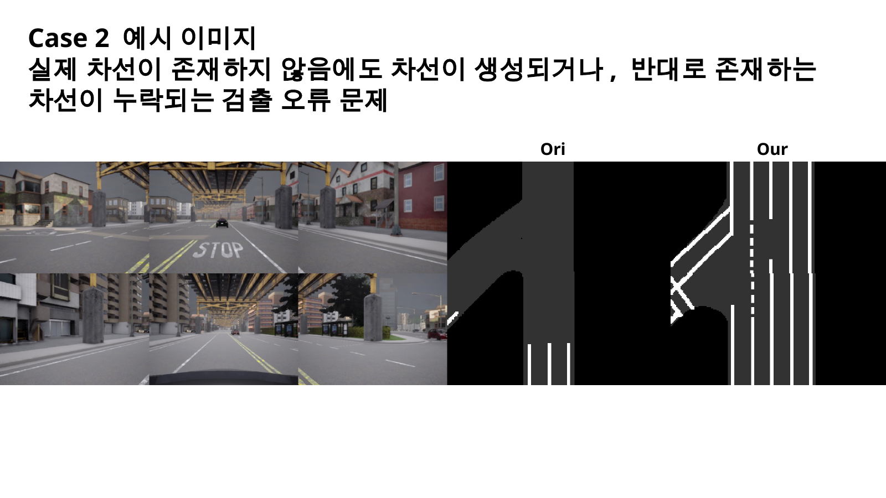

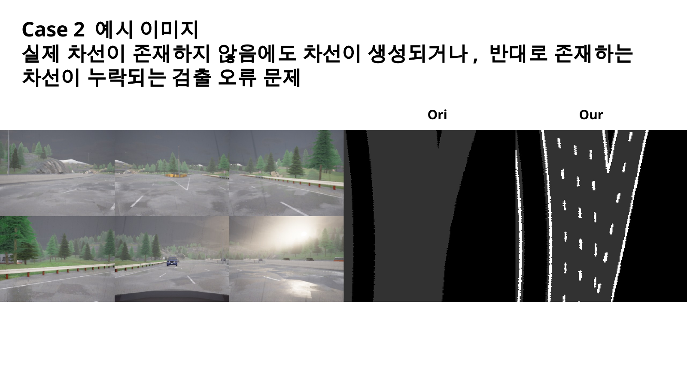

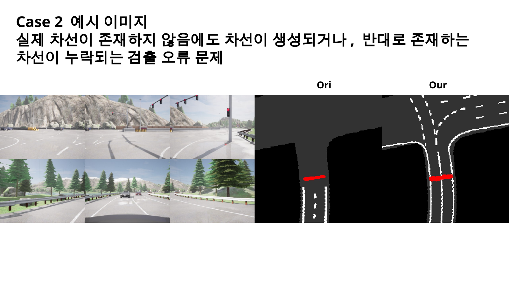

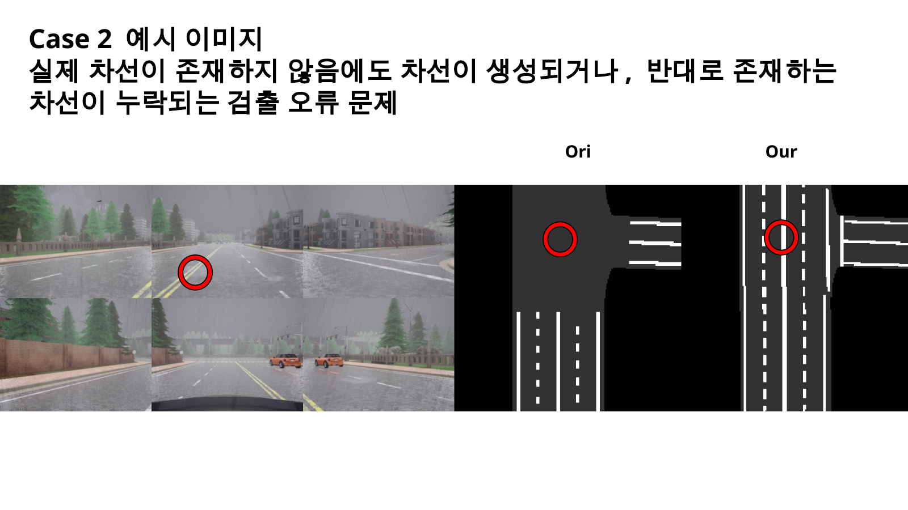

## 사례 3: 주행 가능 영역

**기존·수정 비교 · `Ori` / `Our`.** 주행 가능 영역의 모양을 실제 도로 경계 및 교차로 구조와 비교합니다. 색깔 동그라미는 카메라와 BEV에서 대응하는 영역을 표시합니다. 아래쪽에는 추가 BEV 시각화를 배치했습니다.

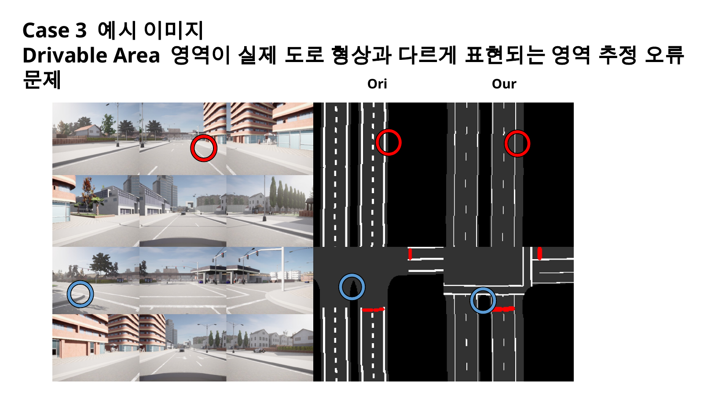

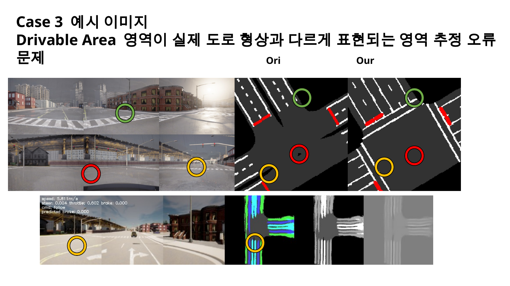

## 사례 4: 도로 고도

고가도로와 하부 도로 주변의 BEV 표현을 비교합니다. 하나의 평면으로 투영하면 자차가 주행 중인 도로와 다른 높이의 도로가 겹쳐 표현될 수 있습니다.

### LAV

색깔 동그라미로 주행 장면과 LAV BEV의 대응 위치를 표시했습니다.

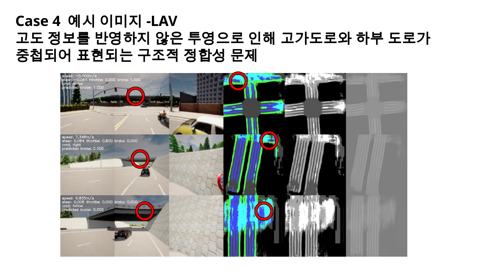

### Roach와 ThinkTwice

Roach와 ThinkTwice의 주행 장면, BEV 표현과 특징 시각화를 함께 보여줍니다.

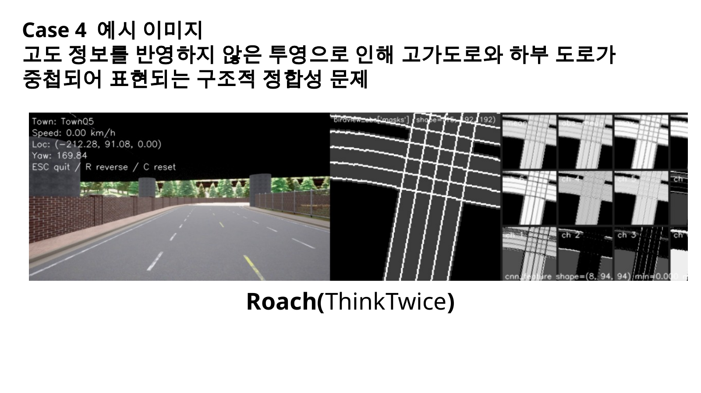

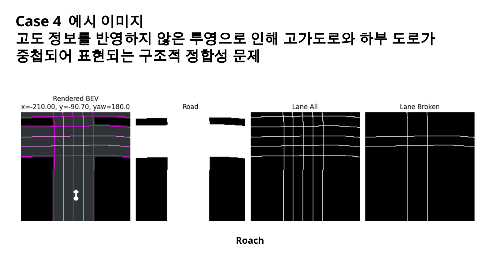

### 기존·수정 비교

`Ori`와 `Our`를 통해 자차 주변에서 서로 다른 높이의 도로가 어떻게 표현되는지 비교합니다.

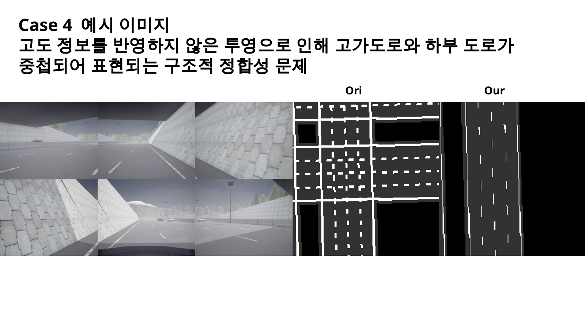

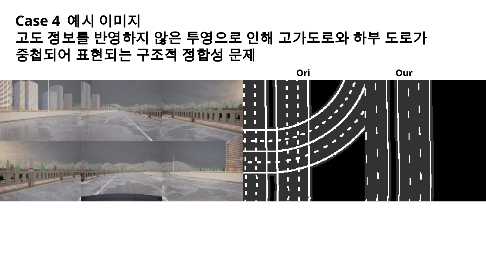

## BEV 생성 배경

CARLA/OpenDRIVE 지도 데이터와 BEV 생성 방식을 살펴볼 때 참고한 자료입니다. 계보 그림은 조사 과정에서 검토한 관계와 메모를 담고 있습니다.

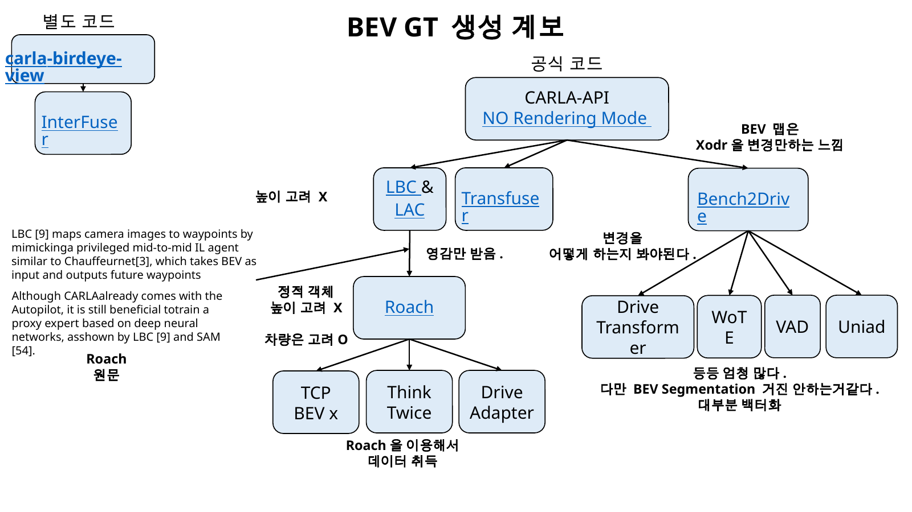

### 렌더링과 항공 지도 생성

### 지도 토폴로지

### 차선 표시 정합성

## 기술 분석

[BEV 라벨 정합성 분석](docs/analysis.md)에서 지도 형상, 래스터화, 네 가지 사례의 해석을 정리했습니다. 본문의 예시는 정성적 비교이며 수치 평가는 포함하지 않습니다.
