# BEV Image Gallery

[HBLR overview](../README.md) · [Technical analysis](analysis.md)

Camera/BEV comparison panels and technical-background excerpts, grouped by topic.

## Rendering and map-generation background

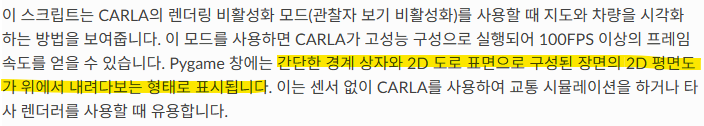

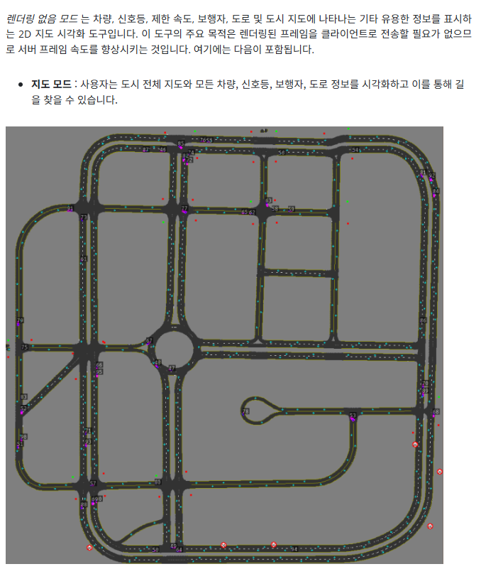

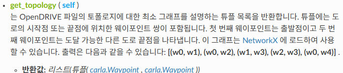

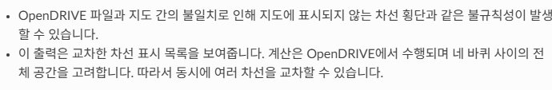

## Lane-marking type

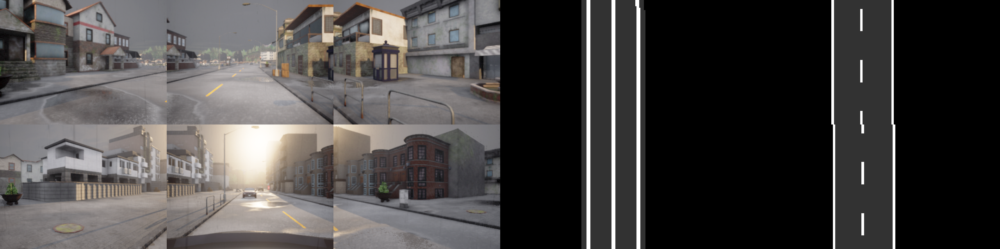

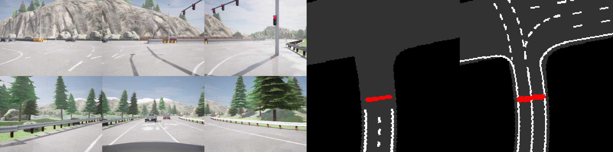

## Reference BEV visualizations

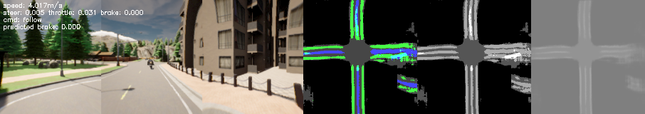

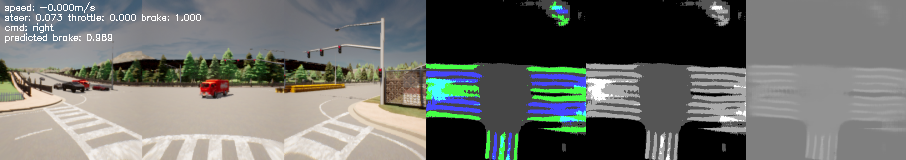

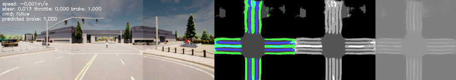

## Lane-presence cases

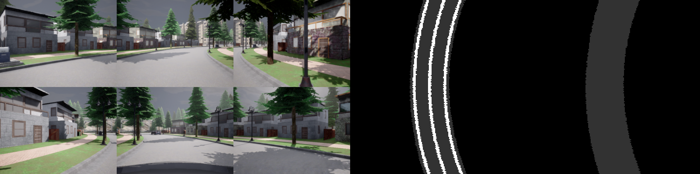

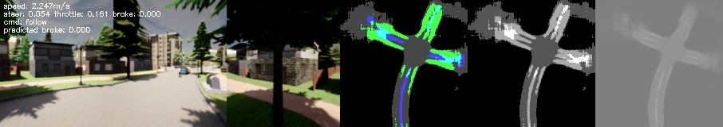

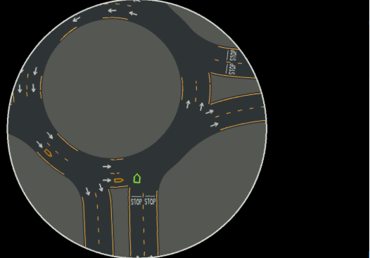

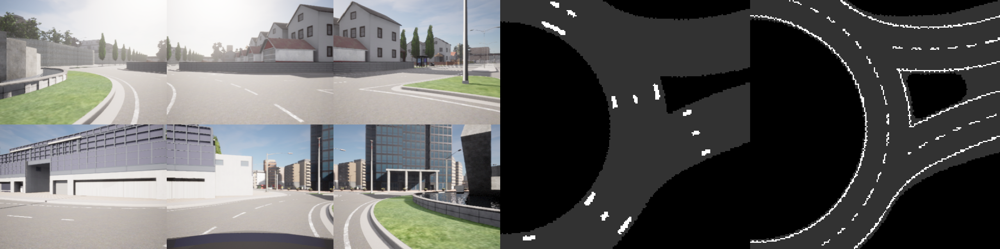

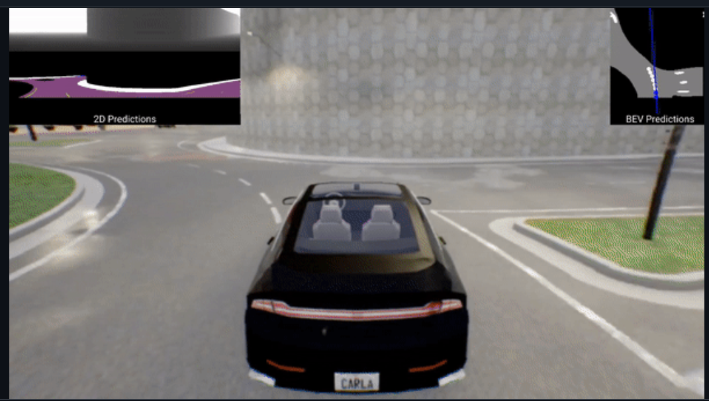

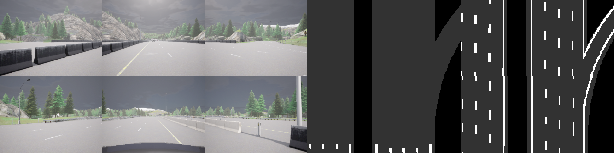

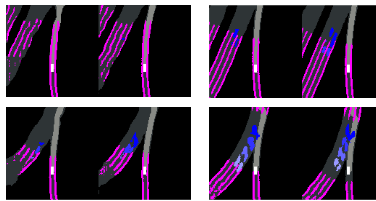

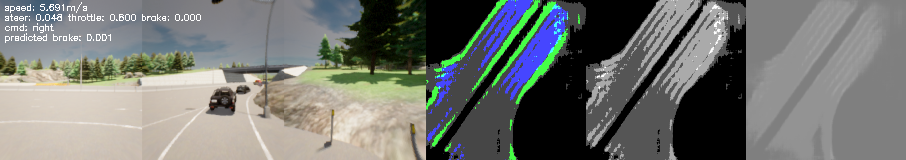

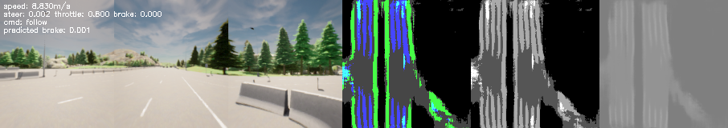

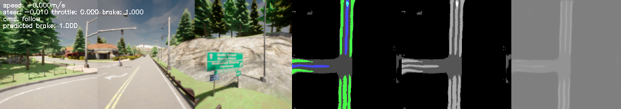

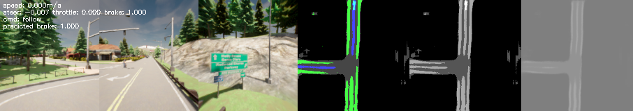

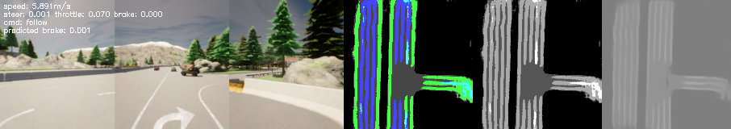

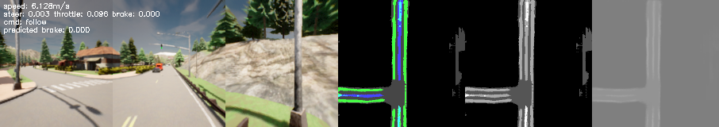

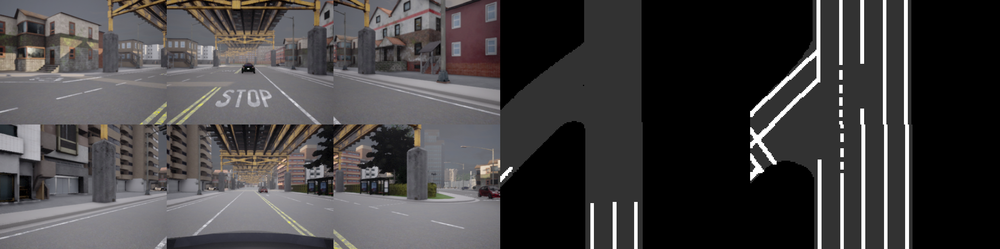

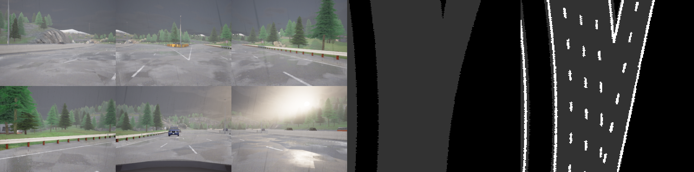

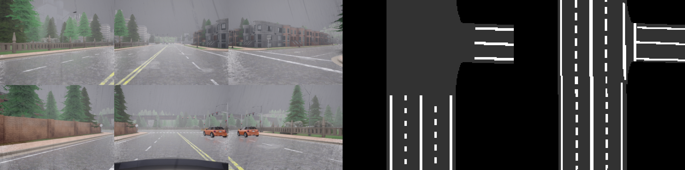

## Drivable geometry

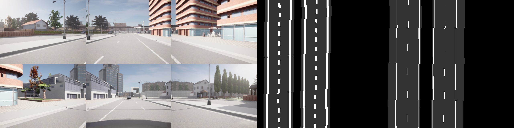

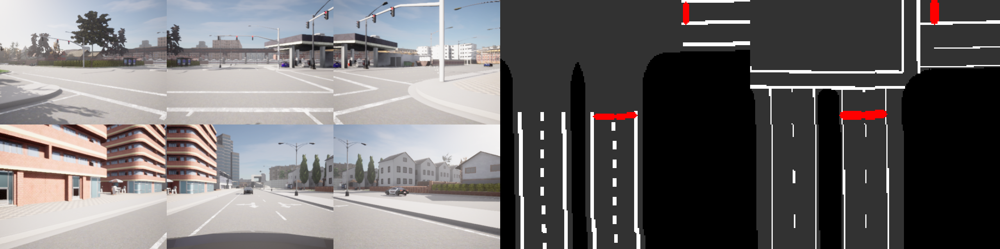

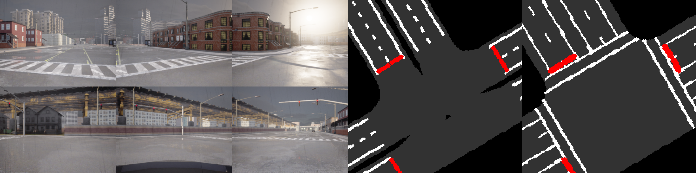

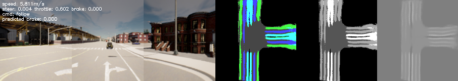

## Elevation and stacked roads

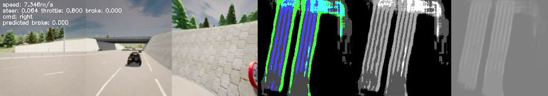

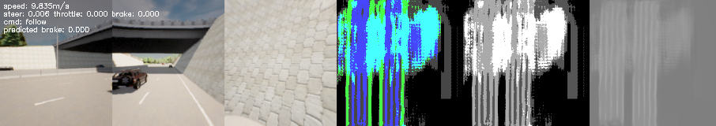

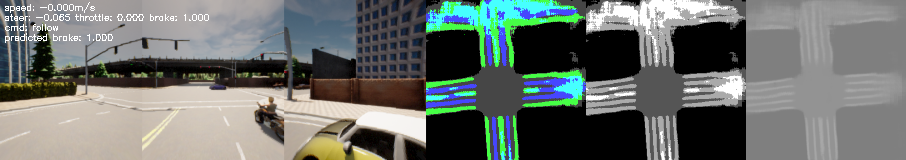

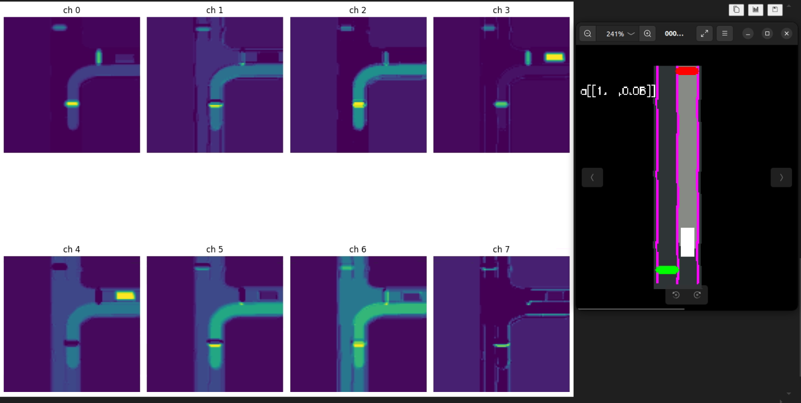

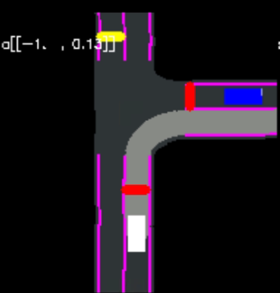

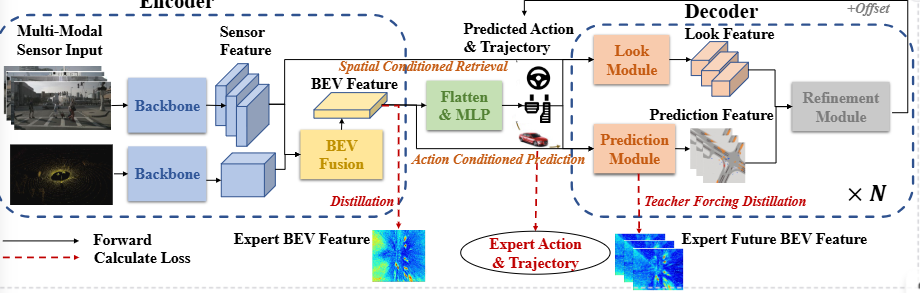

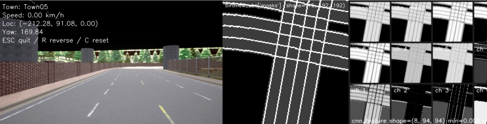

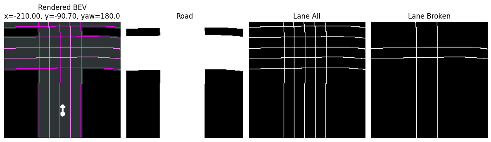

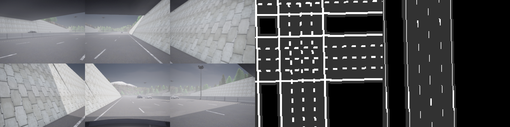

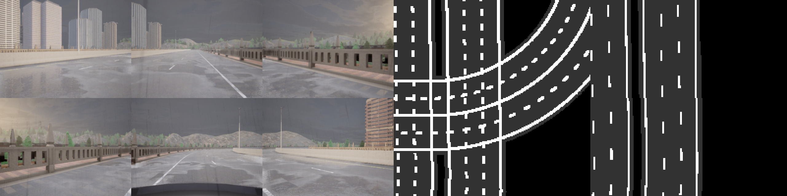

